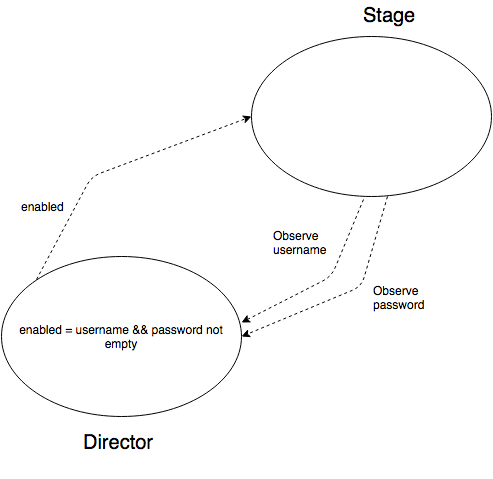

# dehub-ios

## Synopsis

dehub is an app that can be used to view your gists and to create new gists.
It is written using a MVP-like architecture.

## Setup (requires Xcode 8.1/Swift 3.0.1 or greater)

* Install [Carthage](https://github.com/Carthage/Carthage)
* Clone the repo and run ```carthage bootstrap --platform iOS --no-use-binaries```
* Open in Xcode and you are good to go

Note: if you get a build error complaning about a missing module ``Model`` or ``Scene``, change the target to ``Model`` and/or ``Scene`` and build them first.

# Architecture

The app is split into two frameworks, one called ```Model``` and the other called ```View```.
```Model``` is responsible for fetching data from the network and updating the state of the application.
```View``` is responsible for displaying the state on the screen and handling user interaction.

## The View

The view layer architecure is inspired by Srdan Rasic's blog post 
[A Different Take on MVVM with Swift](http://rasic.info/a-different-take-on-mvvm-with-swift/) with some significant changes.

In this architecture, each screen in the app has a ```Scene```, ```Stage``` and ```Director``` object,
which together fulfill the same role as the UIViewController in a vanilla iOS app.

### The ```Stage```

Is responsible for rendering the views (labels, buttons etc) and responding to user input.
The ```Stage``` is "dumb" in that it does not have any business logic.
It doesn't perform any network calls, IO, or updates any state.
It doesn't even know what it "means" when the user taps a button, it just delegates this event to the ```Director```.

### The ```Director```

Tells the ```Stage``` what to do. For example a ```Director``` may call a method ```enableLoginButton(enabled: Bool)``` on its ```Stage```. The ```Stage``` would then enable or disable the login button in this method. The important concept here is that only the ```Director``` contains the logic that decides when and with what argument the ```enableLoginButton(enabled: Bool)``` method should be called.

Let's say that the ```enableLoginButton(enabled: Bool)``` should be called with ```true``` if the user has entered some text in both the username field and the password field. Since the fields are views, they are referenced by the ```Stage```, and since the ```Director``` needs to know their values, the ```Stage``` has to send their values to the ```Director```.

This is done by having the ```Director``` observe the ```Stage```'s values by using RxSwift:



The ```Director``` communicates with the stage by directly calling methods on it, while the ```Stage``` communicates with the ```Director``` by exposing RxSwift properties that the ```Director``` observes.

### The ```Scene```

Creates the ```Stage``` and the ```Director``` and is responsible for transitioning to other scenes. Generally a ```Director``` calls a method on a ```Scene``` when it decides that the scene should change. The ```Scene``` then performs the transition to the new ```Scene```, which creates it's corresponding ```Director``` and ```Stage```.

## Bootstrapping

When the app starts the App Delegate creates the initial ```Scene``` which in turn creates the initial ```Stage``` and ```Director```.

# Main libraries used

##[RxSwift](https://github.com/ReactiveX/RxSwift)##

Used for observing the the view state.

__Learning resources:__
RxSwift has the same fundamental API as RxJava, so RxJava resources can be used for learning the concepts:
* [Grokking RxJava](http://blog.danlew.net/2014/09/15/grokking-rxjava-part-1/) - A good place to start learning.
* [Common RxJava Mistakes](https://www.youtube.com/watch?v=QdmkXL7XikQ) - Watch this once you have some familiarity with RxJava. Then watch it again when you get more comfortable with RxJava.
* [Reactive Programming with RxJava](http://shop.oreilly.com/product/0636920042228.do) - A good in-depth book on RxJava.

For RxSwift specifics, see the [documentation](https://github.com/ReactiveX/RxSwift/tree/master/Documentation).

##[Siesta](https://github.com/bustoutsolutions/siesta)##

A REST library with a Retrofit inspired api. Does not currently support converting network respones to RxSwift observables (though it has support for RxCocoa). If this is implemented in the future we should probably use that API.

__Learning resources:__
* [The user guide](https://bustoutsolutions.github.io/siesta/guide/) - A good guide.


